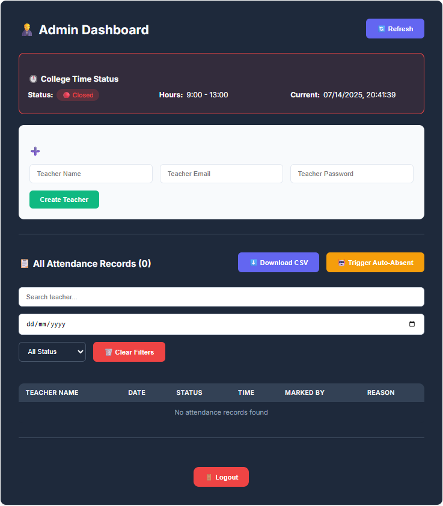

**Smart Attendance Management System (Teacher + Admin Dashboard)**

---

## 📝 Description

A full-stack **Attendance Management System** built using **React.js**, **Firebase Authentication**, **Cloud Firestore**, and a **Node.js/Express** backend. This system allows:

- 👨‍🏫 **Teachers** to mark attendance only within the school network (IP-restricted)
- 👨‍💼 **Admins** to view all attendance records, filter/search by date or teacher, and download CSV reports
- 🔒 Secure authentication for both roles via Firebase
- ☁️ Data storage using Firebase Firestore
- ⚠️ Duplicate attendance prevention (1 mark per day)
- ⚠️ Attendance mark only within the school time
- 📍 Real-time timestamps and attendance history

---

## 📸 Preview



## 🚀 Features

### 🔐 Authentication

- Firebase Email/Password authentication
- Session handling with route protection

### 👨‍🏫 Teacher Dashboard

- Mark attendance only from allowed IP
- Past attendance history with timestamp
- One attendance mark per day
- IP detection and restriction
- Logout functionality

### 👨‍💼 Admin Dashboard

- Create new teachers
- View all attendance from all teachers
- Search and filter by teacher name or date
- Download attendance as CSV
- Secure logout

### 🌐 Backend (Node.js + Express)

- Firebase Admin SDK integration
- Attendance stored in nested collections (`attendance/{uid}/records`)
- Teachers fetched from `users` collection
- IP whitelisting for attendance endpoint

---

## 🛠️ Tech Stack

| Frontend    | Backend           | Auth & DB          | Hosting           |
| ----------- | ----------------- | ------------------ | ----------------- |
| React.js    | Node.js + Express | Firebase Auth      | Vercel (frontend) |
| CSS Modules | REST API          | Firebase Firestore | Render (backend)  |

---

## ⚙️ Setup Instructions

### 1. Clone the repository

```bash
git clone https://github.com/yourusername/attendance-management-system.git
cd attendance-management-system
```

### 2. Setup Firebase

- Create a Firebase project.
- Enable **Email/Password** sign-in.
- Create a Web App and get Firebase Config.
- Generate service account credentials from Firebase Admin SDK and encode to base64:

```bash
base64 path/to/credentials.json
```

- Add to `.env` file:

```env
GOOGLE_CREDENTIALS_BASE64=your_base64_string_here
```

### 3. Backend Setup

```bash
cd server
npm install
npm start
```

Or deploy it to Render.

### 4. Frontend Setup

```bash
cd client
npm install
```

Create a `.env` file:

```env
REACT_APP_BACKEND_URL=https://your-backend-url.com
```

Run locally:

```bash
npm start
```

Or deploy on Vercel.

---

## 📌 Notes

- Teachers can only mark attendance **once per day and with in school time** from **whitelisted IPs**.
- Admins can see **all attendance** from all teachers.
- Time format is **locale-sensitive** and uses consistent formatting in CSV exports.

---

## 🧑‍💻 Author

**Haider Sajjad** – [@haidersajjad](https://github.com/haidersajjad)

---
